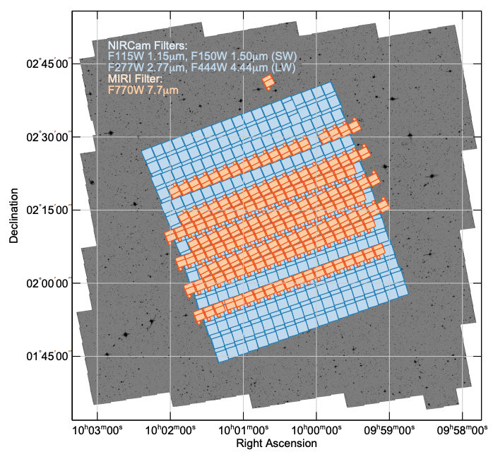

Read the full survey overview paper here: [Casey & Kartaltepe et al. 2022](https://ui.adsabs.harvard.edu/abs/2022arXiv221107865C/abstract)

Above: Map of the COSMOS-Web tiling pattern over _Hubble Space Telescope_ imaging of the COSMOS field. Credit: Casey & Kartaltepe et al. 2022.

---
### Primary Science Goals

- Discover and characterize 6<z<11 galaxies in the Epoch of Reionization

- Identify rare quiescent galaxies at z>4

- Directly measure the evolution of the stellar mass to halo relation out to z~2.5

---

I am particularly interested in using these _JWST_ observations to revisit our NIR-dark dusty galaxies and place firm constraints on their stellar masses, sizes, and morphologies.
