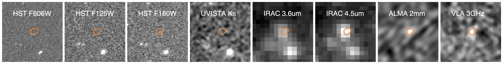

Above: Cutouts of a NIR-dark galaxy called MORA-5 clearly show non-detections in deep _Hubble Space Telescope_ imaging, but strong emission at longer wavelengths. The orange contour depicts the robust (5 sigma) ALMA detection.

Above: This star-formation main sequence plot illustrates the apparent heterogenous nature of some of the NIR-dark galaxies discovered thus far.

These galaxies were discovered in surveys with varying wavelength coverage, depth, and all with distinct selection techniques, further complicating matters as we attempt to work out their formation histories and evolutionary pathways. 
---

### NIR-dark Galaxies in the MORA Survey
Four NIR-dark sources were detected in the MORA Survey (check out more on that survey [here](../mora)). Their photometric properties suggest they might be the highest-redshift objects in our 2mm ALMA map. A complete analysis of these galaxies, their physical properties, and potential evolutionary connection to high redshift quiescent galaxies can be found in [Manning et al. 2022](https://ui.adsabs.harvard.edu/abs/2022ApJ...925...23M/abstract).  

