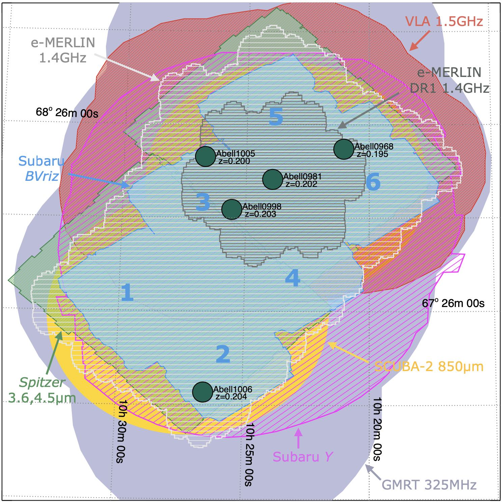

SuperCLASS is a deep, wide-area survey originally designed to detect the effects of weak lensing in radio continuum in a supercluster region. We look to repurpose it to obtain internal ~kpc maps of micro-Jansky radio sources around the peak of cosmic star formation (z~2) and determine their evolutionary origins through morphological analysis.

Above: Coverage map of the SuperCLASS field showing all collected data and the full planned _e_-MERLIN observations (white). Not shown are additional _Hubble Space Telescope_ observations.

---

### What is _e_-MERLIN?
The _enhanced_ Multi-Element Remotely Linked Interferometer Network is a network of seven UK-based radio telescopes headwquartered at Jodrell Bank Observatory. The facility's unique combination of sensitivity and spatial resolution makes it a great tool for tracing spatially resolved star formation in heavily obscured galaxies.

### The SuperCLASS Photometric Redshift Catalog
The first step in our analysis of galaxies discovered in the SuperCLASS Survey was determining their distances, a.k.a. their redshifts. Without spectroscopic observations in hand, I was tasked with creating a photometric redshift catalog for the entire field consisting of roughly ~200,000 galaxies. This was my first project as a graduate student and resulted in my [first first-author publication](https://arxiv.org/pdf/2003.01735.pdf).  

---
### SuperCLASS Publications
#### Project Overview: [Battye et al. (2020)](https://ui.adsabs.harvard.edu/abs/2020MNRAS.495.1706B/abstract)
#### Photometric Redshift Catalog: [Manning et al. (2020)](https://ui.adsabs.harvard.edu/abs/2020MNRAS.495.1724M/abstract)
#### Weak Lensing: [Harrison et al. (2020)](https://ui.adsabs.harvard.edu/abs/2020MNRAS.495.1737H/abstract)